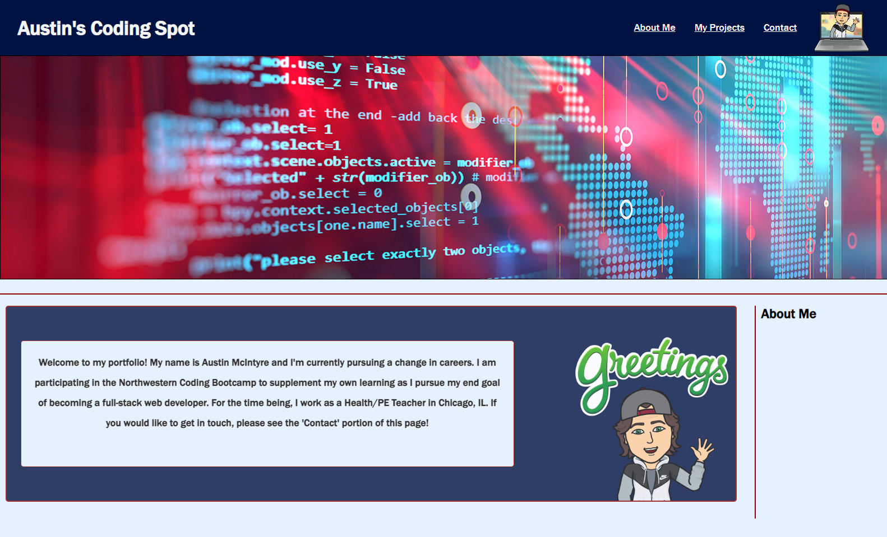

# Personal Portfolio

## Purpose of the Portfolio

This portfolio is a place where I will be able to highlight my work. The website has a header, footer, and three main sections. The sections are; "About Me", "My Projects", and "Contact". Each of these sections will be useful for potential job employers as I begin to search for jobs at the end of this course. 

This portfolio also served as a really good exercise in both HTML and CSS practice. 

## Deployed Link

Live link:  https://aumcintyre.github.io/Personal-Portfolio/

Repo link: https://github.com/aumcintyre/Personal-Portfolio/

## Screenshot

## My Experience

I had a harder time with this project than I anticipated. I started out by simply building a wireframe, but spacing issues led to a lot of wasted or redundant code. I eventually got the frame to look how I wanted, but the code was a mess, so I essentially removed each section and reworked it all. 

Positioning was the biggest issue I ran into throughout this process. I was having trouble with certain flex-box elements which led to one section overlapping or breaking another. I watched several YouTube videos and went back through our class activities, until things just started to click. As it began to make more and more sense, I was able to again comb through the code for each section and further remove unneeded lines.

Once the sections were in place, putting the actual content in them was a pretty straightforward process. I had to continue to debug my original code throughout this process as I kept finding pieces that would override what I was trying to do currently. After a lot of consolidating and cleaning up, the portfolio I produced is one that I'm happy with. 

## Credit

### Images
<ul>
<li>BitMoji</li>
<li>CBS Survivor</li>
<li>St. Andrew's Golf Course</li>
</ul>

### Coding Help
<ul>
<li>W3Schools</li>
<li>Mozilla</li>
<li>Stack Overflow</li>
</ul>
